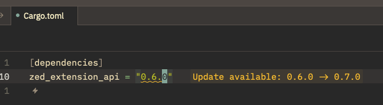
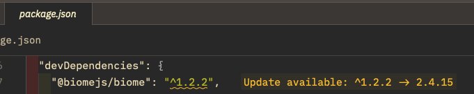
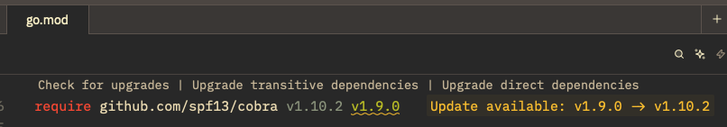
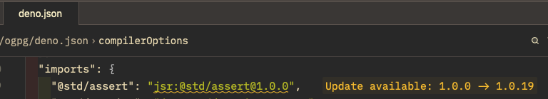
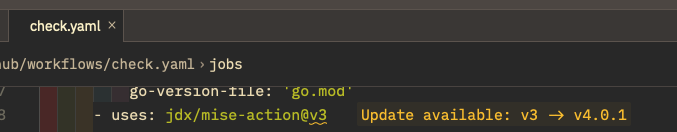

# Zed version-lsp

A [version-lsp](https://github.com/skanehira/version-lsp) extension for [Zed](https://zed.dev).

Provides version checking diagnostics for package dependency files. See [version-lsp](https://github.com/skanehira/version-lsp) for the full list of supported file types.

<table>
<tr>
<td align="center"><br><sub><b>Cargo.toml</b> · crates.io</sub></td>
<td align="center"><br><sub><b>package.json</b> · npm</sub></td>
<td align="center"><br><sub><b>go.mod</b> · Go Proxy</sub></td>
</tr>
<tr>
<td align="center"><br><sub><b>deno.json</b> · JSR</sub></td>
<td align="center"><br><sub><b>GitHub Actions</b> · GitHub Releases</sub></td>
<td></td>
</tr>
</table>

## Installation

Install as a dev extension by cloning this repository and selecting the directory via `zed: install dev extension`.

## Configuration

By default, the language server binary is **not** downloaded automatically. Install the `version-lsp` binary manually and ensure it is on your `PATH`, or set a custom binary path:

```json
{
  "lsp": {
    "version-lsp": {
      "binary": {
        "path": "/path/to/version-lsp"
      }
    }
  }
}
```

To enable automatic download from [GitHub Releases](https://github.com/skanehira/version-lsp/releases), set `auto_download: true` in your settings:

```json
{
  "lsp": {
    "version-lsp": {
      "settings": {
        "auto_download": true
      }
    }
  }
}
```

### Settings

```json
{
  "lsp": {
    "version-lsp": {
      "settings": {
        "auto_download": true,
        "cache": {
          "refreshInterval": 86400000
        },
        "registries": {
          "npm": { "enabled": true },
          "crates": { "enabled": true },
          "goProxy": { "enabled": true },
          "pypi": { "enabled": true },
          "github": { "enabled": true },
          "pnpmCatalog": { "enabled": true },
          "jsr": { "enabled": true },
          "docker": { "enabled": true }
        },
        "ignorePrerelease": true
      }
    }
  }
}
```

| Option | Type | Default | Description |
| --- | --- | --- | --- |
| `auto_download` | boolean | `false` | Automatically download the `version-lsp` binary from GitHub Releases |
| `cache.refreshInterval` | number | `86400000` | Cache refresh interval in milliseconds |
| `registries.npm.enabled` | boolean | `true` | Enable npm registry checks |
| `registries.crates.enabled` | boolean | `true` | Enable crates.io registry checks |
| `registries.goProxy.enabled` | boolean | `true` | Enable Go Proxy registry checks |
| `registries.pypi.enabled` | boolean | `true` | Enable PyPI registry checks |
| `registries.github.enabled` | boolean | `true` | Enable GitHub Releases checks |
| `registries.pnpmCatalog.enabled` | boolean | `true` | Enable pnpm catalog checks |
| `registries.jsr.enabled` | boolean | `true` | Enable JSR registry checks |
| `registries.docker.enabled` | boolean | `true` | Enable Docker Hub / ghcr.io checks |
| `ignorePrerelease` | boolean | `true` | Ignore prerelease versions |

## Development

See the [Developing Extensions](https://zed.dev/docs/extensions/developing-extensions) section of the Zed docs.

```sh
# Check compilation
cargo check --target wasm32-unknown-unknown
```

## License

MIT
